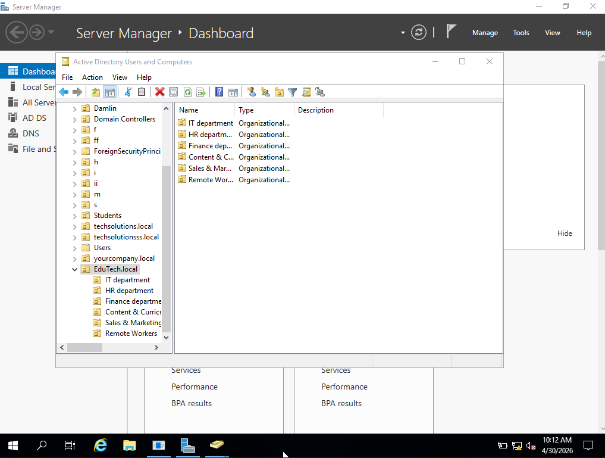
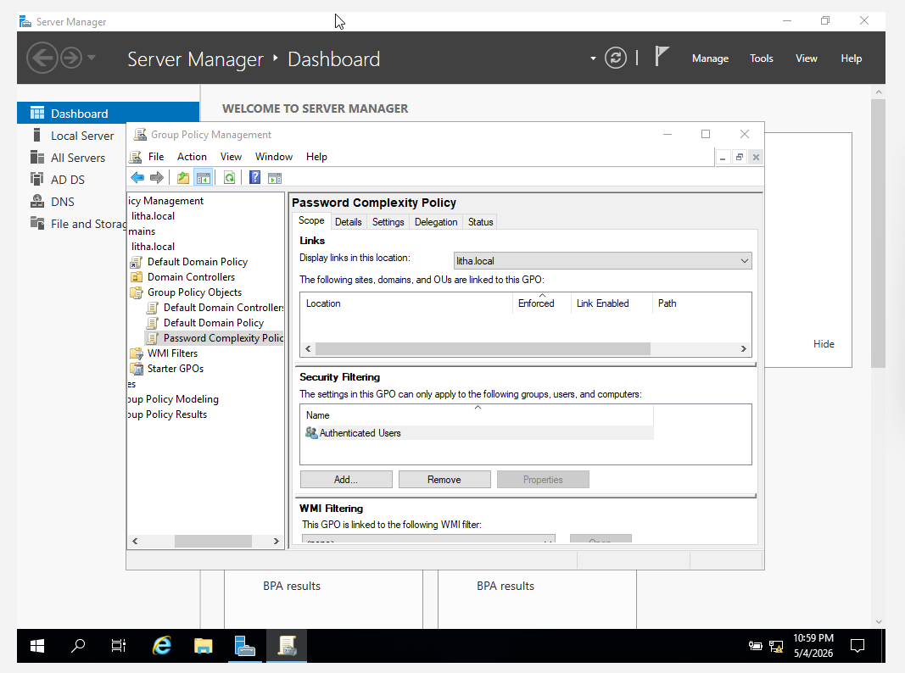
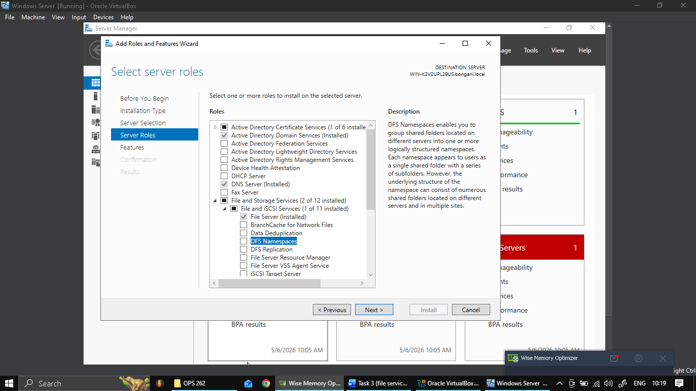
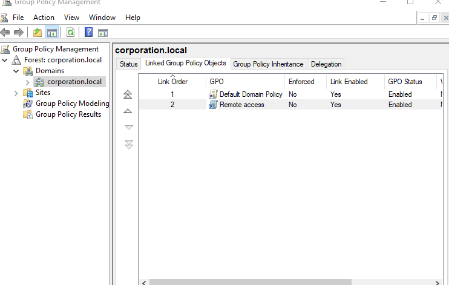
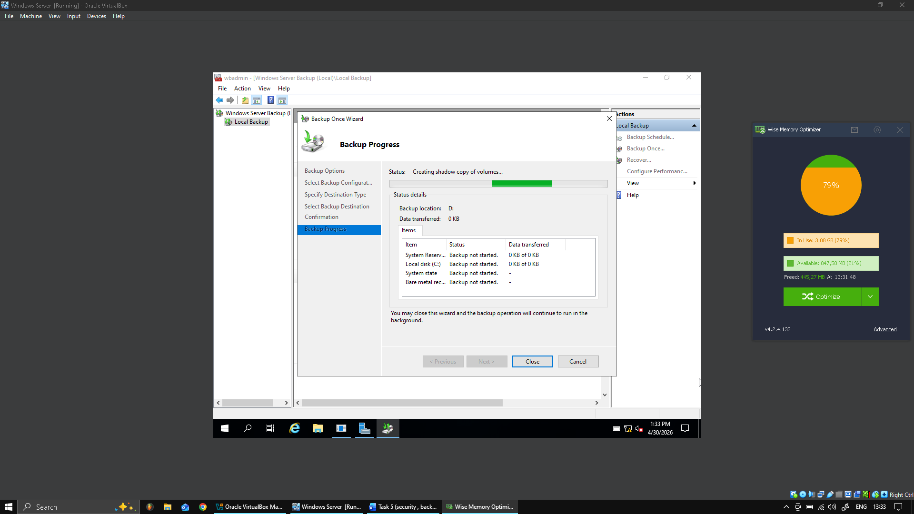
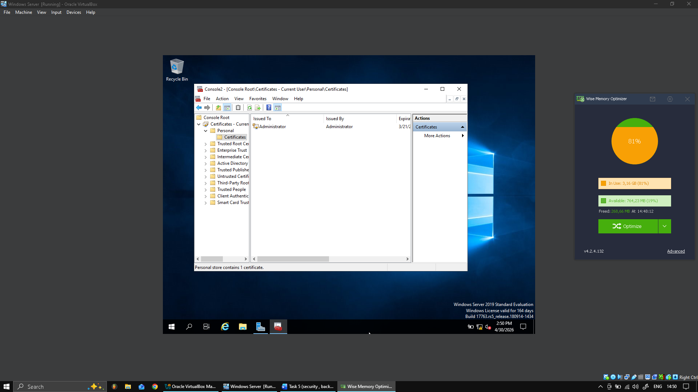
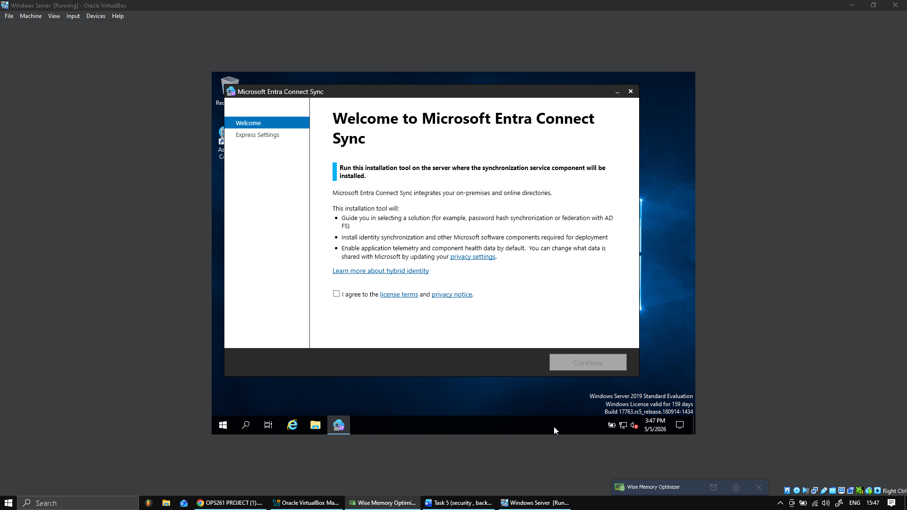

# windows-server-2022-enterprise-lab
Designed and administered a simulated enterprise Windows Server environment focused on centralized identity management, access control, file services, remote access, security hardening and disaster recovery.

01 — Active Directory & Identity

AD DS ;
OU structure;
Users;
Groups;
Delegation;

02 — Group Policy & Security

Password policy;
Login banner;
User restrictions;
Security baselines;

03 — File Services & DFS

HR;
IT;
Sales;
Shared folders;
DFS namespace;

04 — Remote Access

RDS;
RRAS;
VPN;
Remote access policies;

05 — Server Hardening

Unnecessary services;
Microsoft Security Hardening Toolkit;
Event Viewer;
Task Manager monitoring;

06 — Backup & Recovery

Windows Server Backup;
Full server backup;
Disaster recovery;

07 — Certificate Services

Certificate Services;
Certificate store;
PKI;

08 — Cloud Integration

Azure AD Connect;
TLS 1.2 configuration;
Troubleshooting;

